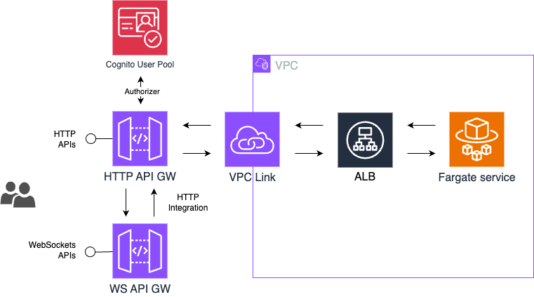

# WebSockets and HTTP API with a private integration to an Amazon ECS service

Based on this tutorial
https://docs.aws.amazon.com/apigateway/latest/developerguide/http-api-private-integration.html



## Launch and test locally

1. Launch localstack

```bash
docker compose up
```

2. Bootstrap

```bash
npm run cdk-deploy-local
```

3. Deploy

```bash
npm run cdk-bootstrap-local
```

4. Run test

```bash
cd integrationTest

export AWS_ACCESS_KEY_ID="test"
export AWS_SECRET_ACCESS_KEY="test"
export ENVIRONMENT="local"

ts-node index.ts

```

## Useful commands:

http tests

```bash
curl -X PUT "https://plxn1f2b37.execute-api.us-east-1.amazonaws.com/api/ws"

curl -v -X PUT "http://9008eb62.execute-api.localhost.localstack.cloud:4566/api/ws"

curl -X GET "https://plxn1f2b37.execute-api.us-east-1.amazonaws.com/api/status"
```

web sockets message dispatch

```bash
aws apigatewaymanagementapi post-to-connection \
--connection-id QHjIJeR-IAMCKxQ= \
--data '{"action": "message", "data": "123"}' \
--endpoint-url https://xxx.execute-api.us-east-1.amazonaws.com/production
```

force reboot ECS task

```bash
aws ecs update-service --cluster test-cluster --service test-service --force-new-deployment
```